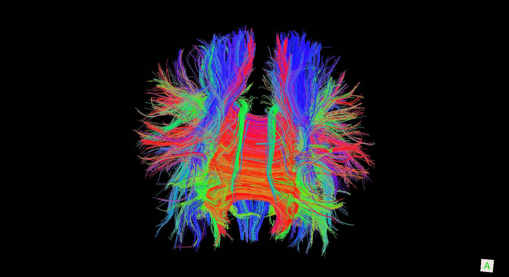
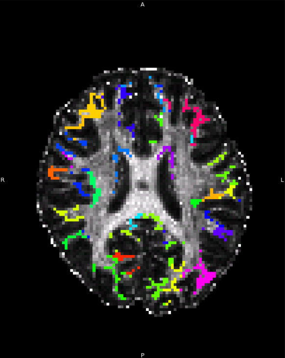
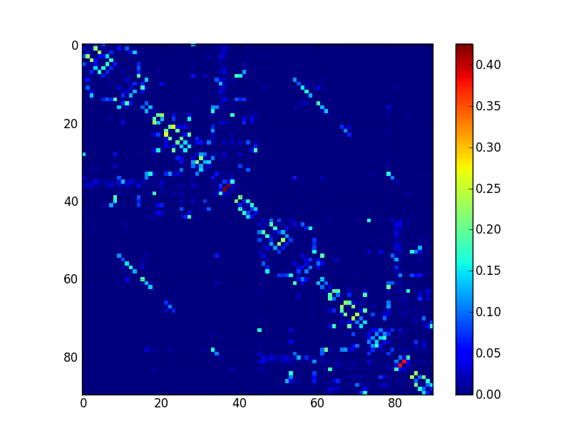

LabBNU
======

This repo contains code utilities when I work at BNU lab.

Relative work:
--------------
1. Brain network analysis
2. 3D/4D brain image processing e.g. region grow algorithm (refer to Freeroi repo)
3. Brain region Clustering and classification using machine learning algorithm e.g. Spectral clustering
4. Text analysis using Topic modeling  (refer to  pytm repo)

Gallery:

2013.12.11
不积跬步无以至千里,不积小流无以成江海
